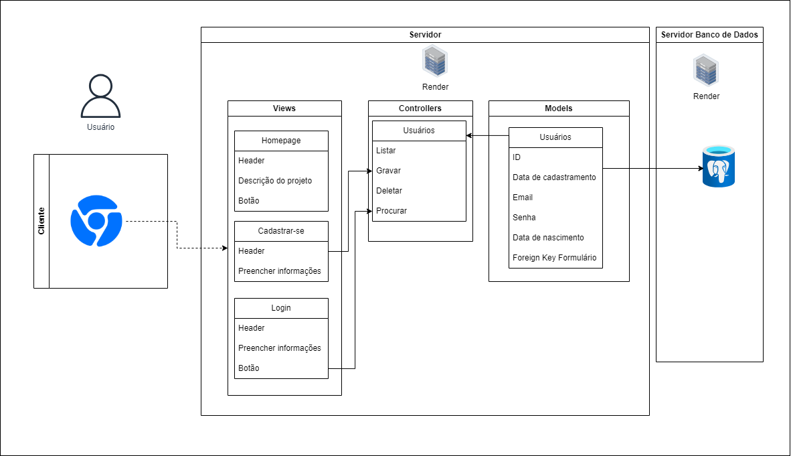
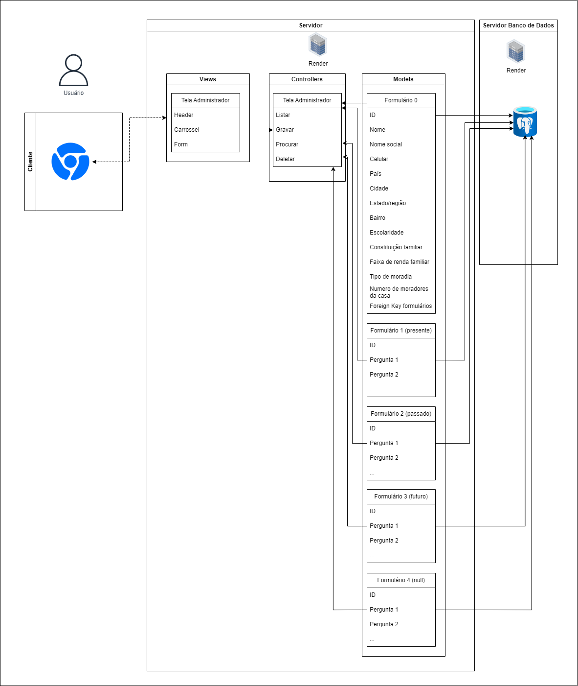
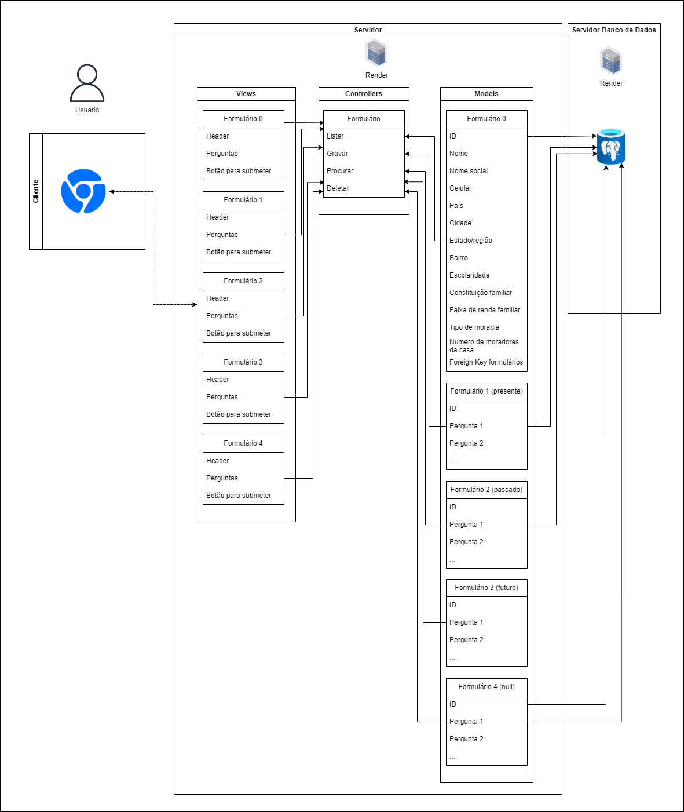

Figura 1 - Parte 1

Fonte: Material produzido pela autora (2024)

Figura 2 - Parte 2

Fonte: Material produzido pela autora (2024)

Figura 3 - Parte 3

Fonte: Material produzido pela autora (2024)

# Abadono Zero

- #### Link para os diagramas [aqui](https://drive.google.com/drive/folders/1nJ14rC7VMY--lSyHyKkfx7KL_4W7L1ep?usp=sharing).

- #### Descrição: 
&nbsp;&nbsp;&nbsp;&nbsp;O projeto consiste no desenvolvimento de uma aplicação web dedicada à coleta de informações sobre o comportamento dos tutores em relação à adoção, compra e eventual abandono de cães. Por meio de um formulário de fácil acesso, os tutores poderão fornecer dados relevantes, enquanto a aplicação os armazena e organiza em uma base de dados estruturada. Dessa forma, essas informações serão essenciais para compreender as razões por trás do abandono de animais a partir de uma análise detalhada das condições dos tutores envolvidos. 
- #### Arquitetura: 
&nbsp;&nbsp;&nbsp;&nbsp;MVC (Model-View-Controller)
- #### Ferramenta de Diagramação: 
&nbsp;&nbsp;&nbsp;&nbsp;A ferramenta utilizada foi o [draw.io](https://app.diagrams.net/).
- ### Modelos (Models):

Quadro 01 - Entidades

| Entidade | Descrição | Atributos |
| ------- | -------- | ------------|
| Usuários   | Armazena os dados essenciais para a realização do cadastro e a chave para o próximo formulário.    | ID, data de cadastramento, email, senha, data de nascimento, foreign key formulário |
| Formulário 0   | Armazena os dados do formulário inicial com os dados do usuário e a chave para qual será o formulário que ele irá responder em seguida.    | ID, nome, nome social, celular, país, estado/região, cidade, bairro, escolaridade, constituição familiar, faixa de renda familiar, tipo de moradia, número de moradores da casa, foreign key formulários|
| Formulário 1 (presente)  | Armazena os dados correspondentes às perguntas feitas a quem possui cachorro.    | ID, Pergunta 1, Pergunta 2, ...|
| Formulário 2 (passado)   | Armazena os dados correspondentes às perguntas feitas a quem já teve algum cachorro.    | ID, Pergunta 1, Pergunta 2, ...|
| Formulário 3 (futuro) | Armazena os dados correspondentes às perguntas feitas a quem quer ter cachorro.    | ID, Pergunta 1, Pergunta 2, ...|
| Formulário 4 (null)  | Armazena os dados correspondentes às perguntas feitas a quem não tem e não quer ter cachorro.    | ID, Pergunta 1, Pergunta 2, ...|

Fonte: Material produzido pela autora (2024)

&nbsp;&nbsp;&nbsp;&nbsp;A entidade Usuários relaciona-se com a entidade Formulário 0, sendo que para um usuário pode haver várias respostas (é possível responder novamente após determinado período de tempo); portanto, as relações são 1:N. Ademais, a entidade Formulário 0 relaciona-se com as entidades Formulário 1, Formulário 2, Formulário 3 e Formulário 4, sendo que para cada vez que o Formulário 0 é preenchido é possível responder apenas uma vez a algum dos demais formulários; logo, a relação é 1:1.

- ### Controladores (Controllers):
- #### Usuários  
&nbsp;&nbsp;&nbsp;&nbsp;Realiza o fluxo de dados das views de cadastro e de login para a entidade Usuários. Seus métodos são Listar, Gravar, Procurar e Deletar, os quais agem sobre os dados recebidos do usuário a fim de atualizar o banco de dados.

- #### Tela do Administrador  
&nbsp;&nbsp;&nbsp;&nbsp;Realiza o fluxo de dados da views de administrador para o banco de dados completo. Seus métodos são Listar, Gravar, Procurar e Deletar, os quais agem sobre os dados recebidos do usuário a fim de atualizar o banco de dados e leem os dados já gravados a fim de os disponibilizar ao usuário.

- #### Formulário  
&nbsp;&nbsp;&nbsp;&nbsp;Realiza o fluxo de dados das views de formulário para as entidades correspondentes. Seus métodos são Listar, Gravar, Procurar e Deletar, os quais agem sobre os dados recebidos do usuário a fim de atualizar o banco de dados.

- ### Views (Views):

Quadro 2 - Views

| View | Função |
| ------- | -------- |
| Homepage   | Disponibiliza as informações sobre o projeto, além de um botão que direciona o usuário à tela de cadastro.    |
| Login   | Apresenta os campos a serem preenchidos pelo usuário a fim de acessar o formulário no status correto para ele.    | 
| Cadastrar-se   | Apresenta os campos a serem preenchidos para a criação de um novo usuário.    | 
| Tela Administrador   | Tela em que são dispostos alguns dos dados e onde é possível baixá-los em sua totalidade ou em partes.     | 
| Formulário 0, Formulário 1, Formulário 2, Formulário 3, Formulário 4    | Possui os enunciados e os campos para respostas das perguntas do questionário.    | 

Fonte: Material produzido pela autora (2024)

- #### Infraestrutura:
&nbsp;&nbsp;&nbsp;&nbsp;Os dados da aplicação serão armazenados em um Banco de Dados PostgreSQL, o qual será conectado à camada Model da arquitetura MVC, ao disponibilizar a essa camada os dados estruturados nela. Para que o usuário acesse a camada View, ele utilizará um browser, o que facilita o acesso, por ser uma ferramenta comumente disponível e por não precisar realizar a instalação de aplicações extras.

- #### Implicações da Arquitetura:
&nbsp;&nbsp;&nbsp;&nbsp;A utilização da arquitetura MVC facilita a organização do código, o que torna a manutenção mais fácil, pois cada parte do projeto tem sua responsabilidade claramente definida.

